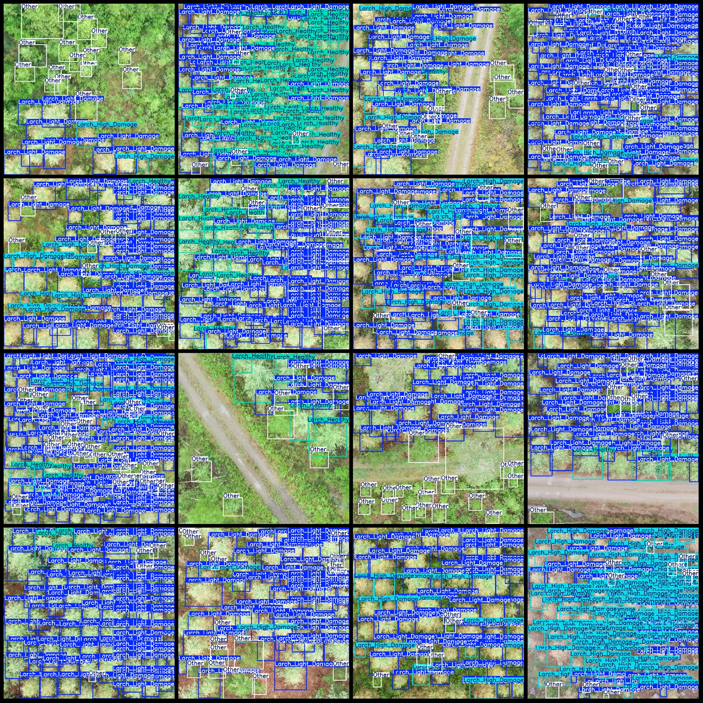
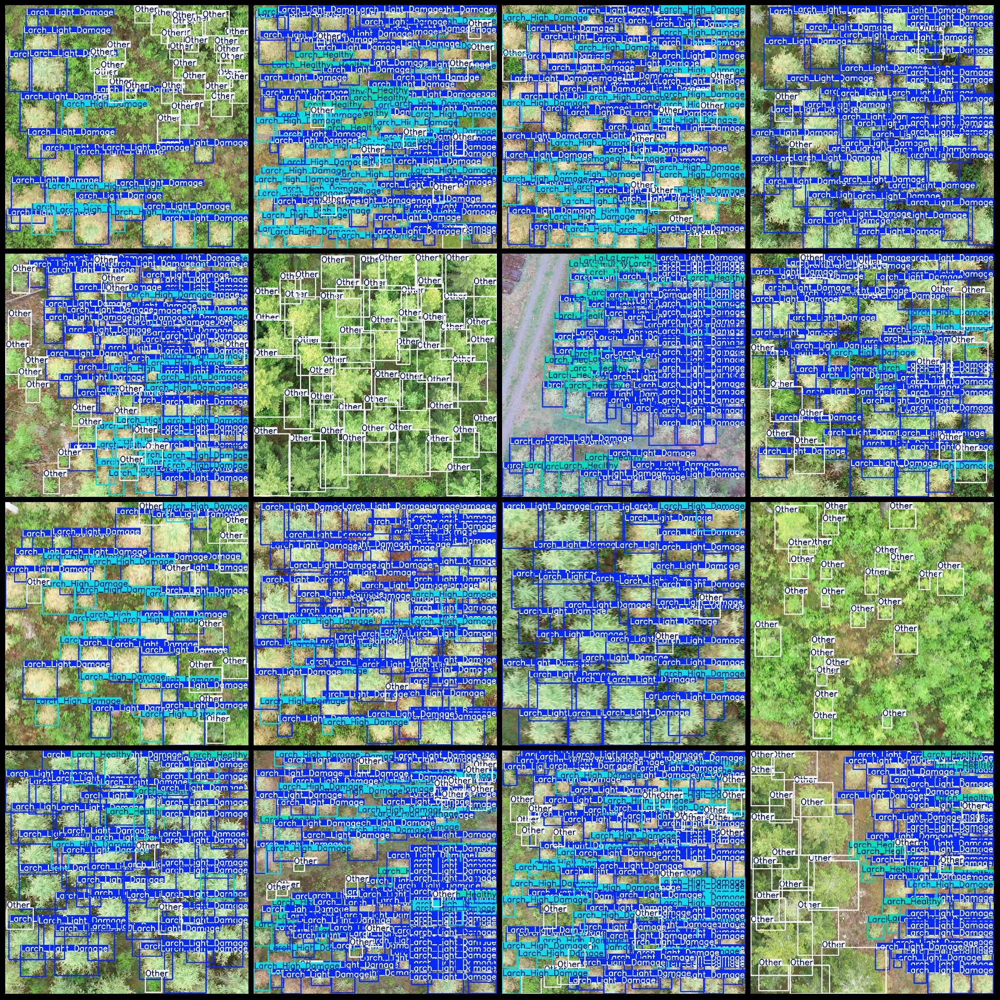

# Drone Perspective on the Health Status and Disease Detection of Larches in VOC+YOLO Format

Dataset format: Pascal VOC format + YOLO format (txt file without split path, only containing jpg images and corresponding VOC format xml files and YOLO format txt files)
Number of images (jpg file count): 5004
Number of annotations (xml file count): 5004
Number of annotations (txt file count): 5004
Number of categories: 4
Annotation category names: ["Larch_Healthy", "Larch_High_Damage", "Larch_Light_Damage", "Other"]
Box numbers for each category:
- Larch_Healthy (healthy larch): 15828 boxes
- Larch_High_Damage (severely damaged larch): 54432 boxes
- Larch_Light_Damage (lightly damaged larch): 199530 boxes
- Other (other): 68316 boxes
Total box numbers: 338106
Number of images per category:
- Larch_Healthy (healthy larch): 1854 images
- Larch_High_Damage (severely damaged larch): 3864 images
- Larch_Light_Damage (lightly damaged larch): 4566 images
- Other (other): 4776 images
Image resolution: 1500x1500
Annotation tool used: labelImg
Annotation rules: draw a box around the category
Important note: The dataset does not have been divided into training, validation, or test sets; you need to divide them yourself.
Special declaration: This dataset does not guarantee the accuracy of the trained model or weight files.
Image preview:
Annotation example:

## Images

Here is a pay link on Stripe ( https://buy.stripe.com/3cs8yP7sY87d0vu9AB ). Please contact me lonlonago@foxmail.com after funding $89, and I will send you a complete data files , thank you!

